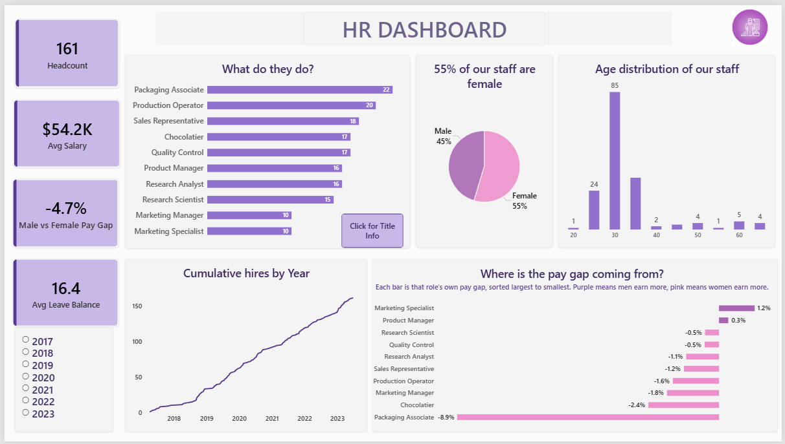
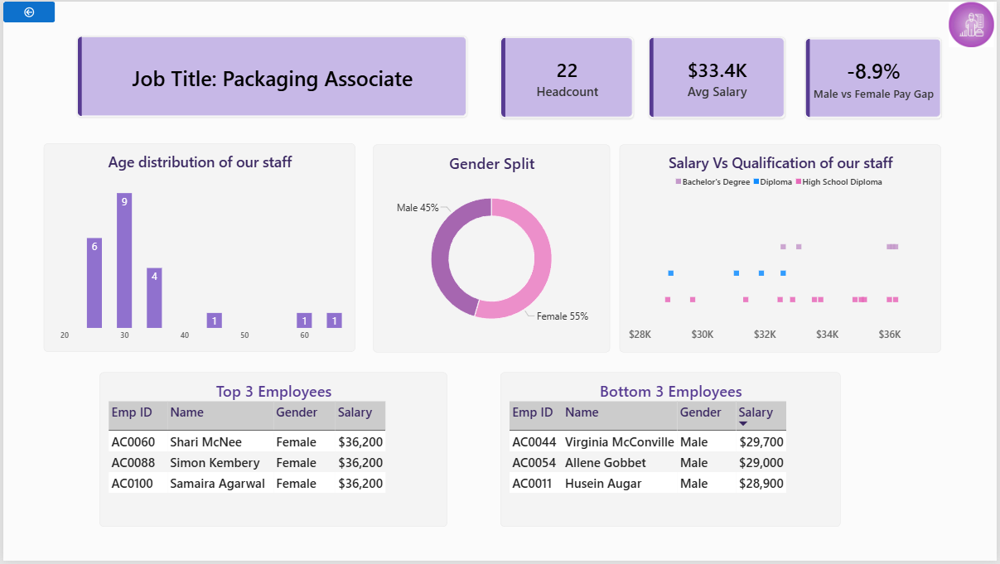

# 1. HR Analytics Dashboard

*A Power BI dashboard for exploring headcount, pay, and hiring trends across a 161-person workforce, with a role-level drill-through for checking pay-equity claims against the actual numbers inside each job title.*

## 2. Purpose

The dashboard gives HR a fast way to check headcount, compensation, and gender pay equity without pulling raw employee records for every role individually.

## 3. At a glance

- Headcount: 161
- Average salary: $54.2K
- Average leave balance: 16.4 days
- Male vs Female pay gap (company-wide): -4.7%

## 4. Tech stack

Built in Power BI Desktop, with Power Query for data prep and DAX for the custom measures: the gender pay gap calculation and the dynamic drill-through title (documented in [dax.md](dax.md)). Delivered as a `.pbix` file with `.png` exports for the screenshots below.

## 5. Data source

One flat table, 161 rows, one row per employee: name, employee ID, age, gender, education qualification, job title, hire date, salary, and leave balance. This is practice data used to build the dashboard, not real employee records. There's no exit or termination date, so attrition and turnover aren't covered.

## 6. Features

### Business problem
HR wants a fast read on headcount, pay, and gender pay equity, but a single company-wide number can hide what's happening inside individual roles. Comparing pay by gender without controlling for role risks overstating or understating a real gap.

### Goal
Give HR a two-page view: a company-wide summary on page one, and a role-level breakdown on page two, where the same KPIs recalculate for whichever job title gets selected.

### Key visuals

Page one:
- Headcount, average salary, average leave balance, and gender pay gap as KPI cards
- Headcount by job title (bar chart)
- Gender split (pie chart)
- Age distribution (histogram)
- Gender pay gap by job title (diverging bar chart), with a caption explaining how to read it
- Cumulative hires since 2018 (line chart), with a year slicer

Page two, drill-through by job title:
- A page title that updates to the selected role
- Role-specific headcount, average salary, and gender pay gap
- Age distribution, gender split, and salary vs. qualification, filtered to that role
- Top 3 and bottom 3 earners within the role

### Business impact & insights
* The company-wide gender pay gap of -4.7% isn't evenly spread across roles. 
* Nine of the ten job titles sit within about two points of parity, but **Packaging Associate**, the company's largest role by headcount, sits at -8.9%, nearly four times the next-largest gap. * That single role is what's pulling the company-wide number down, which means this reads as a targeted compensation review for one role rather than a broad, company-wide policy issue.

## Screenshots

*Page one: Overview.*

*Page two: role-level breakdown, shown here for Product Manager.*
